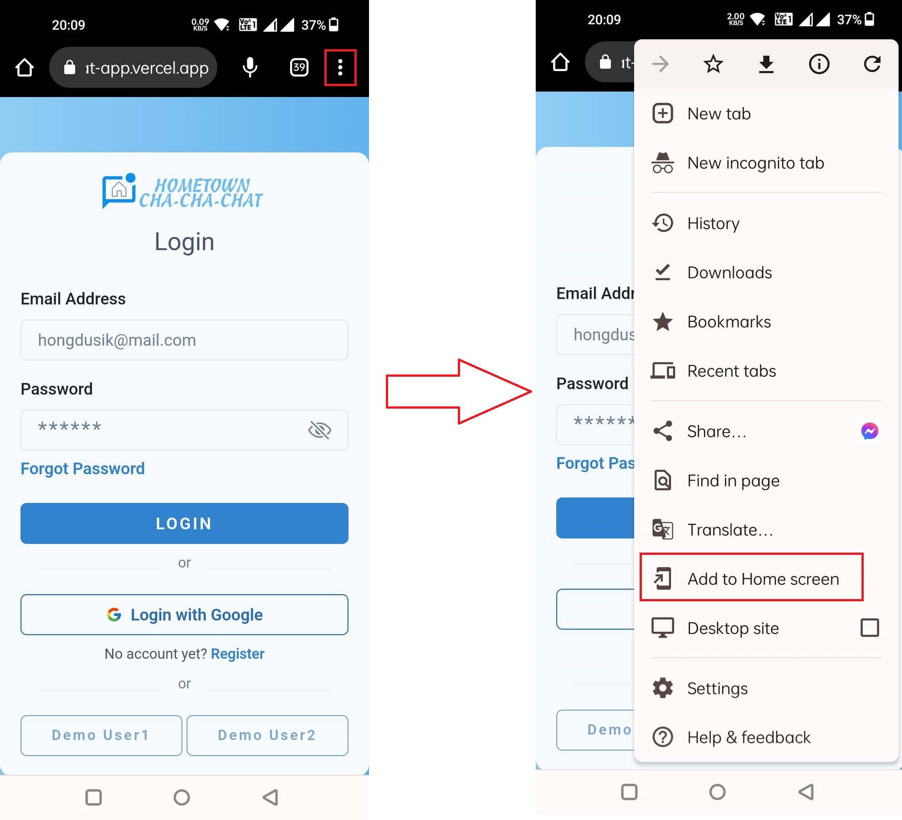

# Realtime Chat App using React and Firebase

This Chat App allows you to communicate in real time. I used React and Firebase to store data and authentication. I used Chakra UI for the styles.

## Features

- Real time data
- Authentication (Login, Register, Forgot Password, Google Auth)
- Mobile Responsive
- Users can add friends and see their online status
- Users can change theme, emoji, and nickname
- Users can update their profile picture and display name
- Users can send text, images, and videos (less than 2Mb)
- Users can delete their message
- Users can update profile (change display name, profile picture, and password)

## Live Preview

https://homechat-app.vercel.app/

> **If you are using mobile/tablet device, add the app to home screen first**

1. Click the link
2. Open in mobile browser
3. Click the _menu_ on the top right side (depends on your browser)
4. Click "Add to home screen"
5. Wait until it's finished
6. Open the app and enjoy 😉

